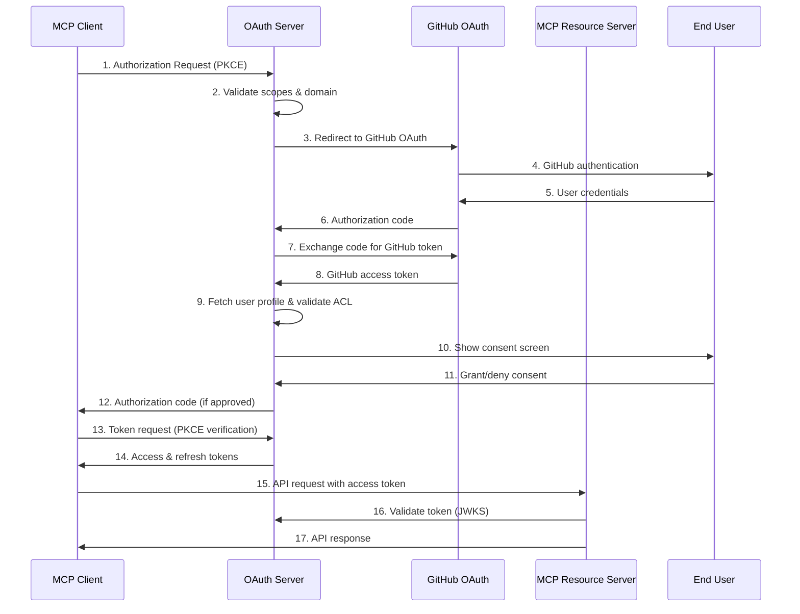
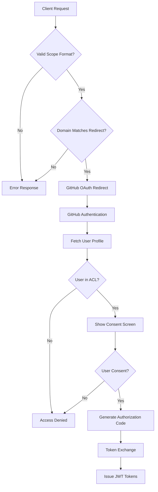
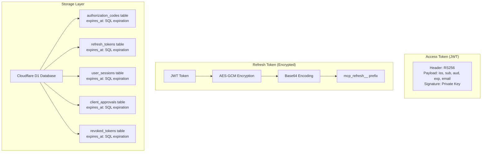
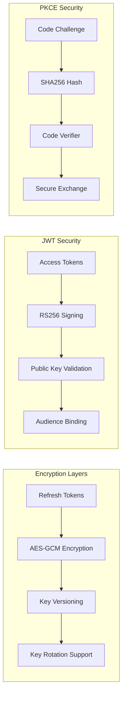
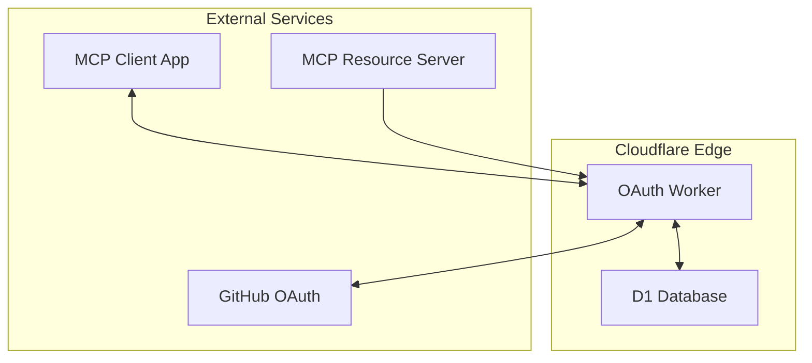

# MCP OAuth Authorization Server - Architecture Documentation

## Overview

The MCP OAuth Authorization Server is a comprehensive **OAuth 2.1/OIDC-compliant authorization server** built on Cloudflare Workers, specifically designed for securing Model Context Protocol (MCP) resources. It implements a 2-hop authentication architecture using GitHub as the identity provider while enforcing fine-grained access controls for MCP servers.

## High-Level Architecture



## Core Components

### 1. Authentication & Authorization Flow



### 2. Token Architecture



### 3. Security Architecture



### API Endpoints

#### OAuth 2.1 Endpoints

- `GET /authorize` - Authorization endpoint with PKCE
- `POST /authorize` - Consent form submission
- `POST /token` - Token endpoint (authorization_code, refresh_token grants)

#### Discovery & Metadata

- `GET /.well-known/oauth-authorization-server` - OAuth server metadata (RFC 8414)
- `GET /.well-known/openid_configuration` - OIDC discovery
- `GET /.well-known/jwks.json` - JSON Web Key Set

#### GitHub Integration

- `GET /auth/github/callback` - GitHub OAuth callback handler

#### Administration

- `GET /health` - Health check endpoint
- `POST /admin/revoke` - Token revocation endpoint
- `GET /` - Server information endpoint

### Token Specifications

NOTE: these are ideas on implementation and the ideal solution may differ

#### Access Token Structure

```typescript
interface AccessToken {
	token_type: "access";
	iss: string; // Issuer (authorization server URL)
	exp: number; // Expiration (1 hour from issuance)
	sub: string; // Subject (GitHub user ID)
	aud: string; // Audience (MCP scope)
	email?: string; // User email (if user:email scope requested)
}
```

#### Refresh Token Structure

```typescript
interface RefreshToken {
	token_type: "refresh";
	iss: string; // Issuer (authorization server URL)
	exp: number; // Expiration (30 days from issuance)
	sub: string; // Subject (GitHub user ID)
	aud: string; // Audience (MCP scope)
	email?: string; // User email (if user:email scope requested)
}
```

### Scope Validation Rules

1. **Format Validation**: `mcp:<domain>:<server>` pattern
2. **Single Scope**: Only one MCP scope allowed per request
3. **Domain Matching**: MCP scope domain must match redirect URI domain
4. **Server Configuration**: MCP server must exist in ACL config
5. **User Authorization**: User must be in server's allowed_users list
6. **Additional Scopes**: Optional `email` scope supported

### Security Features

#### Encryption

- **Refresh Tokens**: AES-GCM encrypted with dedicated key
- **Key Rotation**: Versioned keys with graceful rotation
- **Key Derivation**: SHA-256 hash of environment key material

#### Token Security

- **JWT Signing**: RS256 algorithm with configurable key pairs
- **Token Prefixes**: Clear identification of token types
- **Audience Binding**: Tokens bound to specific MCP scopes
- **Short Expiration**: 1-hour access tokens, 30-day refresh tokens

#### PKCE Implementation

- **S256 Method**: SHA-256 code challenge method
- **Secure Verification**: Code verifier validation on token exchange
- **Replay Protection**: Authorization codes single-use with TTL

## Deployment Architecture

### Cloudflare Workers Environment



## Standards Compliance

### OAuth 2.1 (RFC 6749bis)

- Authorization Code flow with PKCE (RFC 7636)
- Refresh token rotation
- Token endpoint authentication methods
- Error response formats

### OpenID Connect

- Discovery endpoint (RFC 8414)
- JWKS endpoint for public keys
- Standardized claim names

### Security Standards

- RFC 7636: PKCE for OAuth Public Clients
- RFC 8414: OAuth 2.0 Authorization Server Metadata
- RFC 9728: OAuth 2.0 Protected Resource Metadata
