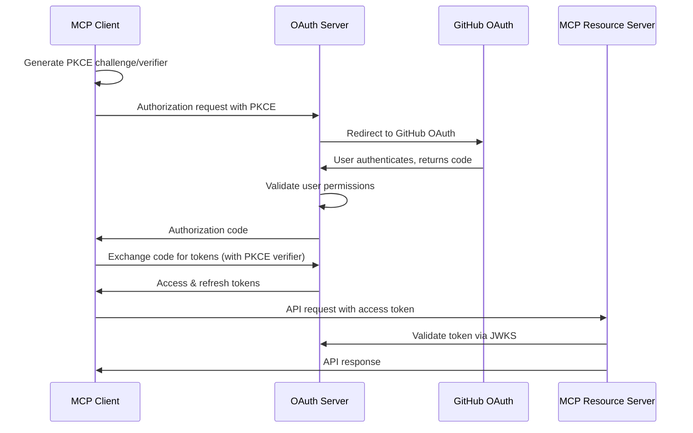

# MCP OAuth Client Integration Guide

This guide explains how to integrate with the MCP OAuth Authorization Server as both an OAuth client (requesting access) and as a resource server (validating tokens).

## Overview

The MCP OAuth Authorization Server implements OAuth 2.1 with PKCE for securing Model Context Protocol (MCP) resources. It uses GitHub as the identity provider and enforces fine-grained access controls based on MCP scopes.

## OAuth Flow



## Server Endpoints

| Endpoint | Description |
|----------|-------------|
| `GET /authorize` | OAuth authorization endpoint |
| `POST /token` | Token exchange endpoint |
| `GET /.well-known/jwks.json` | Public keys for token validation |
| `GET /.well-known/oauth-authorization-server` | OAuth server metadata |
| `POST /validate` | Validate JWT access tokens |
| `POST /admin/revoke` | Revoke access or refresh tokens |
| `GET /health` | Health check |

**Base URLs:**
- Production: `https://auth.mcp.r167.dev`
- Staging: `https://mcp-oauth-authorization-server-staging.wmdurand.workers.dev`

## MCP Scopes

Scopes follow the pattern: `mcp:<domain>:<server>` where:
- `domain`: Must match your redirect URI domain
- `server`: Must be configured in the auth server's ACL
- Additional scope: `email` (optional, provides user email in token)

Example: `mcp:example.com:github-tools email`

## As an OAuth Client (Requesting Access)

### 1. PKCE Challenge Generation

```javascript
import crypto from 'crypto';

function generatePKCE() {
  const codeVerifier = crypto.randomBytes(32).toString('base64url');
  const codeChallenge = crypto.createHash('sha256')
    .update(codeVerifier)
    .digest('base64url');
  
  return { codeVerifier, codeChallenge };
}
```

### 2. Authorization Request

Redirect user to:
```
https://auth.mcp.r167.dev/authorize?
  response_type=code&
  client_id=your-client-id&
  redirect_uri=https://example.com/callback&
  scope=mcp:example.com:github-tools email&
  state=random-state-value&
  code_challenge=YOUR_CODE_CHALLENGE&
  code_challenge_method=S256
```

### 3. Handle Authorization Callback

Extract the `code` parameter from the callback URL.

### 4. Exchange Code for Tokens

```javascript
const response = await fetch('https://auth.mcp.r167.dev/token', {
  method: 'POST',
  headers: { 'Content-Type': 'application/x-www-form-urlencoded' },
  body: new URLSearchParams({
    grant_type: 'authorization_code',
    code: authorizationCode,
    redirect_uri: 'https://example.com/callback',
    client_id: 'your-client-id',
    code_verifier: codeVerifier
  })
});

const tokens = await response.json();
// Returns: { access_token, refresh_token, token_type: 'Bearer', expires_in }
```

### 5. Refresh Tokens

```javascript
const response = await fetch('https://auth.mcp.r167.dev/token', {
  method: 'POST',
  headers: { 'Content-Type': 'application/x-www-form-urlencoded' },
  body: new URLSearchParams({
    grant_type: 'refresh_token',
    refresh_token: currentRefreshToken,
    client_id: 'your-client-id'
  })
});
```

## As a Resource Server (Validating Tokens)

### 1. Fetch Public Keys

```javascript
const jwksResponse = await fetch('https://auth.mcp.r167.dev/.well-known/jwks.json');
const jwks = await jwksResponse.json();
```

### 2. Validate JWT Token

```javascript
import jwt from 'jsonwebtoken';
import jwksClient from 'jwks-rsa';

const client = jwksClient({
  jwksUri: 'https://auth.mcp.r167.dev/.well-known/jwks.json'
});

function getKey(header, callback) {
  client.getSigningKey(header.kid, (err, key) => {
    const signingKey = key.publicKey || key.rsaPublicKey;
    callback(null, signingKey);
  });
}

// Validate token
const token = req.headers.authorization?.replace('Bearer ', '');
const decoded = jwt.verify(token, getKey, {
  issuer: 'https://auth.mcp.r167.dev',
  audience: 'mcp:example.com:github-tools',
  algorithms: ['RS256']
});

// decoded contains: { sub, aud, iss, exp, email? }
```

### 3. Extract User Information

```javascript
const userId = decoded.sub;        // GitHub user ID
const scope = decoded.aud;         // MCP scope
const userEmail = decoded.email;   // User email (if requested)

## Quick Token Validation

For debugging or simple validation, use the `/validate` endpoint:

### Using Authorization Header
```bash
curl -X POST https://auth.mcp.r167.dev/validate \
  -H "Authorization: Bearer YOUR_ACCESS_TOKEN"
```

### Using Request Body
```bash
curl -X POST https://auth.mcp.r167.dev/validate \
  -H "Content-Type: application/json" \
  -d '{"token": "YOUR_ACCESS_TOKEN"}'
```

### Response Format
```json
{
  "valid": true,
  "payload": {
    "token_type": "access",
    "sub": "12345678",
    "aud": "mcp:example.com:github-tools", 
    "iss": "https://auth.mcp.r167.dev",
    "exp": 1698765432,
    "iat": 1698761832,
    "email": "user@example.com"
  }
}
```

### Error Response
```json
{
  "valid": false,
  "error": "Token is expired"
}
```

## Token Revocation

Revoke access tokens or refresh tokens using the `/admin/revoke` endpoint:

### Request Format
```bash
curl -X POST https://auth.mcp.r167.dev/admin/revoke \
  -H "Content-Type: application/json" \
  -d '{"token": "YOUR_TOKEN_HERE"}'
```

The endpoint accepts both access tokens and refresh tokens in the same format.

### Success Response
```json
{
  "message": "Token revoked successfully"
}
```

### Error Responses
```json
{
  "error": "invalid_request",
  "error_description": "Missing token parameter"
}
```

```json
{
  "error": "invalid_token",
  "error_description": "Invalid access token"
}
```

**Note**: Once a token is revoked, it will fail validation in both the `/validate` endpoint and in standard JWT verification with revocation checking enabled.

## Token Structure

### Access Token (JWT)
```json
{
  "token_type": "access",
  "iss": "https://auth.mcp.r167.dev",
  "sub": "12345678",
  "aud": "mcp:example.com:github-tools",
  "exp": 1698765432,
  "iat": 1698761832,
  "email": "user@example.com"
}
```

### Refresh Token
Encrypted opaque token with prefix `mcp_refresh__`. Use only for token refresh.

## Error Handling

### OAuth Errors
```json
{
  "error": "invalid_request",
  "error_description": "Missing required parameter: code_challenge"
}
```

### Common Error Codes
- `invalid_request`: Missing or invalid parameters
- `invalid_client`: Invalid client_id
- `invalid_grant`: Invalid or expired authorization code
- `invalid_scope`: Invalid MCP scope format or unauthorized access
- `access_denied`: User denied authorization or not in ACL

## Security Best Practices

1. **Use HTTPS**: All communications must use HTTPS
2. **Validate State**: Always validate the `state` parameter to prevent CSRF
3. **Store Tokens Securely**: Store tokens in secure storage (not localStorage)
4. **Handle Token Expiration**: Implement automatic token refresh
5. **Validate Audience**: Always verify the token audience matches your expected scope
6. **Short-lived Access Tokens**: Access tokens expire in 1 hour
7. **Rotate Refresh Tokens**: Refresh tokens are rotated on each use

## Configuration Requirements

### For MCP Clients
1. Register your domain and server in the auth server configuration
2. Ensure your redirect URI domain matches your MCP scope domain
3. Implement proper PKCE flow
4. Handle token storage and refresh

### For MCP Resource Servers
1. Validate JWT tokens using JWKS endpoint
2. Verify audience claim matches your MCP scope
3. Check token expiration
4. Extract user identity from token claims

## Examples

See the following language-specific examples in this directory:
- [Go Client](./go/client.go) - Complete OAuth client implementation
- [Ruby Client](./ruby/client.rb) - OAuth client with token management
- [TypeScript Client](./typescript/client.ts) - Modern OAuth client with PKCE

Each example includes both OAuth client functionality (for requesting tokens) and resource server functionality (for validating tokens).

## Testing

### Development Environment
Use the development server for testing:
```
BASE_URL=http://localhost:8787
```

### Production Environment  
```
BASE_URL=https://auth.mcp.r167.dev
```

### Health Check
```bash
curl https://auth.mcp.r167.dev/health
```

Expected response:
```json
{"status":"ok","timestamp":"2025-08-17T..."}
```

## Troubleshooting

### Common Issues

1. **Domain Mismatch**: Ensure your MCP scope domain matches your redirect URI domain
2. **User Not Authorized**: Verify the user is in the `allowed_users` list for your MCP server
3. **Invalid PKCE**: Ensure code_challenge and code_verifier are generated correctly
4. **Token Validation Fails**: Check that you're using the correct JWKS endpoint and validating audience
5. **Scope Format**: Ensure scope follows `mcp:<domain>:<server>` pattern

### Debug Steps

1. Check OAuth server metadata: `GET /.well-known/oauth-authorization-server`
2. Verify JWKS availability: `GET /.well-known/jwks.json`
3. Validate your MCP scope format and permissions
4. Check browser network tab for redirect chain issues
5. Verify PKCE challenge/verifier generation

## Support

For issues with the OAuth server itself, check the server logs and health endpoint. For integration questions, refer to the example implementations in this directory.